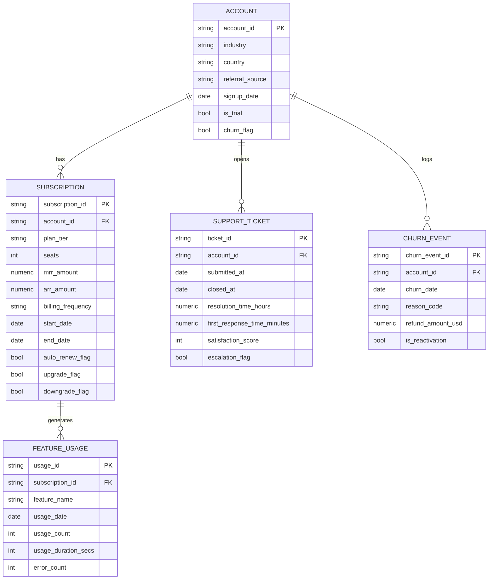

#  SaaS Churn & Risk Analysis — End-to-End Business Intelligence Project

> A complete data analytics project covering Python data engineering, SQL analysis, and Power BI dashboard development on a synthetic B2B SaaS customer dataset.

---

##  Project Overview

**Project Title:** SaaS Customer Churn & Risk Analysis (RavenStack)
**Tools:** Python (pandas) · SQL (PostgreSQL) · Power BI · DAX

---

##  Problem Statement

A SaaS company wants to understand why customers churn, which customer segments are most at risk, and what business factors are associated with customer churn. Without a clear view of *why* accounts leave — as opposed to just *how many* — retention effort gets spread evenly across the customer base instead of concentrated where it would actually move the needle. This project analyzes subscription, usage, and support data to identify real churn drivers, separate them from plausible-sounding factors that don't actually hold up, and quantify the revenue at risk — answering the chain:

1. Why are customers leaving?
2. Who is most likely to leave?
3. What factors are associated with churn?
4. What can the company do to retain them?

---

##  Repository Structure

```
ravenstack-churn-analysis/
│
├── data/
│   ├── ravenstack_accounts.csv          ← raw source data
│   ├── ravenstack_subscriptions.csv
│   ├── ravenstack_feature_usage.csv
│   ├── ravenstack_support_tickets.csv
│   └── ravenstack_churn_events.csv
│
├── notebooks/
│   ├── SAAS_data_loading.ipynb          ← load, dedupe, clean, push to Postgres
│   └── SAAS_Python_EDA.ipynb            ← exploratory analysis
│
├── sql/
│   ├── SAAS_feature_engineering.sql     ← builds account_level_features
│   ├── SAAS_Business_Questions.sql      ← 47 business queries
│   └── SAAS_power_bi_view.sql           ← dashboard source views
│
├── dashboard/
│   └── raven_churn_dashboard.pbix       ← 4-page Power BI dashboard
│
├── screenshots/
│   ├── page1_overview.png
│   ├── page2_churn_drivers.png
│   ├── page3_revenue_impact.png
│   └── page4_account_explorer.png
│
└── README.md
```

---

##  Dataset Overview

| Metric | Value |
|--------|-------|
| Accounts | 500 |
| Subscriptions | 5,000 (2–19 per account) |
| Feature usage records | 24,979 (post-dedup) |
| Support tickets | 2,000 |
| Churn events | 600 |
| Overall churn rate | 22.00% |
| Total MRR (current subscriptions) | $1,214,351 |
| MRR at risk | 20.58% |

**Five source tables, one leakage-safe analytical table:**
- `accounts_clean` — 500 accounts: industry, country, referral source, signup date, churn flag
- `subscriptions_clean` — 5,000 rows: plan tier, seats, MRR/ARR, billing frequency (multiple rows per account — plan changes over time)
- `feature_usage_clean` — usage events per subscription
- `support_tickets_clean` — tickets with resolution time, satisfaction score, escalation flag
- `churn_events_clean` — churn date and reason per churn event
- `account_level_features` — one row per account, built by rolling up all five tables (see Feature Engineering below)

---

##  Entity Relationship Diagram (ERD)



---

##  Step 1 — Python: Data Loading, Cleaning & Deduplication

**File:** `notebooks/SAAS_data_loading.ipynb`

### Workflow
```
Raw CSVs → Parse Dates → Deduplicate feature_usage → 
Standardize Text Columns → Final Cleaning Audit → Push to PostgreSQL
```

### Data Cleaning Steps
- Parsed all date columns (`signup_date`, `start_date`, `end_date`, `usage_date`, `submitted_at`, `closed_at`, `churn_date`)
- Deduplicated `feature_usage` on `usage_id` — **21 duplicate rows removed** (25,000 → 24,979)
- Standardized text columns — stripped whitespace across all ID and category fields
- Final audit confirmed zero duplicate primary keys and zero unresolved nulls across all five tables before pushing to Postgres

### Data Quality Issues Found & Resolved
| Issue | Resolution |
|---|---|
| 21 duplicate `usage_id` values | Deduplicated, kept first occurrence |
| `churn_flag` inconsistent across `accounts`/`subscriptions`/`churn_events` | Standardized on `accounts_clean.churn_flag` as the single source of truth |
| Accounts have 2–19 subscription rows each | Used a `current_subscription` (most recent by start date) per account for all one-row-per-account analysis |
| Several early queries fanned out account counts by joining `subscriptions` directly | Rebuilt with pre-aggregating CTEs to roll up to one row per account before joining |

---

##  Step 2 — SQL: Feature Engineering & Business Questions

**Files:** `sql/SAAS_feature_engineering.sql`, `sql/SAAS_Business_Questions.sql`

###  Two Data Leakage Bugs Found and Fixed

Building `account_level_features` (a leakage-safe, one-row-per-account table designed for downstream modeling) surfaced two separate leakage issues — worth documenting since catching these was a bigger part of this project than the SQL and dashboard work that followed:

**1. Churn-event-derived columns used as features.** The first version included `churn_events` count, `total_refund_amount`, and `reactivations` — all sourced from a table that, by definition, only has rows for accounts that already churned. These were removed entirely from the feature table; a model trained on them would look artificially perfect and be useless on new data.

**2. `customer_tenure_days` computed against the real-world date.** Retained accounts' tenure was originally `CURRENT_DATE - signup_date` — but the dataset's timeline ends 2024-12-31, while `CURRENT_DATE` reflects whenever the query actually runs (in practice, ~21 months later). This inflated every retained account's tenure relative to churned accounts (whose tenure is correctly bounded by an in-dataset churn date), making tenure an almost perfect, tautological predictor. A Decision Tree trained on the leaky version scored a suspicious **1.00 across every metric** — the tell that something was wrong. Fixed by computing a `snapshot_date` (the latest date anywhere in the data) and measuring both groups against that instead of `CURRENT_DATE`.

```sql
-- Fixed tenure calculation
snapshot_date AS (
    SELECT GREATEST(
        (SELECT MAX(COALESCE(end_date, start_date)) FROM subscriptions_clean),
        (SELECT MAX(usage_date) FROM feature_usage_clean),
        (SELECT MAX(submitted_at) FROM support_tickets_clean),
        (SELECT MAX(churn_date) FROM churn_events_clean)
    )::date AS snapshot_date
)
...
CASE
    WHEN a.churn_flag = TRUE THEN fc.first_churn_date - a.signup_date::date
    ELSE sd.snapshot_date - a.signup_date::date
END AS customer_tenure_days
```

### 47 Business Queries Across 5 Sections

| Section | Queries | Business Question |
|---------|---------|------------------|
| Subscription Analysis | Q1–Q12 | What does the current subscription base look like? |
| Account Analysis | Q13–Q17 | Who are the customers, and where does revenue come from? |
| Churn Analysis | Q18–Q37 | Who churns, why, and how much revenue does it cost? |
| Feature Usage Analysis | Q38–Q41 | Does product usage differ between churned and retained accounts? |
| Support Analysis | Q42–Q45 | Does support experience differ between churned and retained accounts? |

### SQL Techniques Demonstrated

| Technique | Used In |
|-----------|---------|
| CTEs (`WITH` clause) | Feature engineering, Q26–Q37, Q40–Q41 |
| Window Functions (`ROW_NUMBER`, `SUM OVER PARTITION BY`) | current-subscription selection, Q29 |
| `HAVING` clause (noise filtering on small segments) | Q35, Q36 |
| `FILTER` clause | escalation counts, industry churn |
| `GREATEST()` for a data-derived snapshot date | leakage fix |
| Date-interval joins (churn-relative windows) | Q41 (usage decline before churn) |
| `CASE WHEN` bucketing | tenure groups, MRR segments, seat-size segments |

---

##  Step 3 — Python: Exploratory Data Analysis

**File:** `notebooks/SAAS_Python_EDA.ipynb`

Exploratory analysis of churn patterns across account attributes, cross-checked against the SQL business-questions results to confirm every chart matches the underlying query output before being trusted.

### What Was Explored
- Churn rate by industry, referral source, plan tier, billing frequency, trial status, and auto-renewal status
- Tenure-at-churn distribution and bucketed churn timing (0–30 days through 1yr+)
- Plan-change behavior (upgrade/downgrade/no change) vs. churn

> This project's machine learning component (model training, evaluation, and feature-importance analysis) is maintained as a separate repository: **[ravenstack-churn-prediction](#)** — kept independent so this repo stays focused on descriptive/diagnostic analysis and the dashboard.

---

##  Step 4 — Power BI: Interactive Dashboard

**File:** `dashboard/raven_churn_dashboard.pbix`

The dashboard answers the business question chain descriptively, at the segment level, rather than scoring individual accounts.

### DAX Measures — Key Patterns

**Core rate pattern:**
```dax
Total Accounts = COUNTROWS(powerbi_account_view)

Churned Accounts = CALCULATE([Total Accounts], powerbi_account_view[churn_flag] = TRUE)

Churn Rate % = DIVIDE([Churned Accounts], [Total Accounts])
```

**Revenue-at-risk pattern:**
```dax
Total MRR = SUM(powerbi_account_view[mrr_amount])

Churned MRR = CALCULATE([Total MRR], powerbi_account_view[churn_flag] = TRUE)

MRR at Risk % = DIVIDE([Churned MRR], [Total MRR])
```

**Segment average pattern:**
```dax
Avg Tenure (Churned) =
CALCULATE(
    AVERAGE(powerbi_account_view[customer_tenure_days]),
    powerbi_account_view[churn_flag] = TRUE
)
```

### Dashboard Pages

### Page 1 — SaaS Churn Overview
**Business Question:** How bad is churn, and where does it concentrate?


**KPIs:** Total Accounts, Churned Accounts, Churn Rate %, MRR at Risk %

**Key Visuals:**
- Churn split donut — 390 retained (78%) vs 110 churned (22%)
- Churn rate by industry — DevTools 30.97% vs Cybersecurity 16.00%

---

### Page 2 — Churn Risk Drivers
**Business Question:** Why are customers leaving, and who is most likely to leave?


**Key Visuals:**
- Churn rate by tenure group — U-shaped: 35.2% (0–3mo) → 17.4% → 13.5% (lowest) → 21.4% (12+mo)
- Churn rate by referral source — event 30.2% vs partner 14.6%
- Churn rate by escalation history and billing frequency
- Featured callout: **DevTools + Event/Ads — 43.5% churn rate, $190K+ MRR at risk**, the single highest-risk segment
- Insight callouts on two counterintuitive, verified findings: usage volume and satisfaction score are *not* reliable churn warning signs in this data

---

### Page 3 — Revenue Impact
**Business Question:** Where does churn hurt the business financially?


**Key Visuals:**
- Churned MRR by industry
- Avg MRR vs churn rate by referral source (combo chart) — event and ads are lowest-value *and* highest-risk simultaneously
- Top revenue-at-risk segments table, sorted by churned MRR, with conditional formatting on churn rate

---

### Page 4 — Account Explorer
**Business Question:** Can any claim on the other three pages be verified directly against the data?


**Key Visuals:**
- Five slicers (industry, referral source, tenure group, plan tier, churn status)
- Full filterable account-level table

---

##  Key Business Insights

### 1. Tenure is the strongest churn driver — and it isn't a straight line
- 0–3 month accounts churn at **35.2%** — the highest-risk window
- Risk drops to a low of **13.5%** by 6–12 months
- Risk **resurfaces to 21.4%** for 12+ month accounts — a second risk point, likely tied to renewal/budget-review timing, not just onboarding

### 2. Industry and referral source are real, large effects — not just tenure
- DevTools churns at **30.97%**, nearly 2x Cybersecurity/EdTech (~16%)
- Event-sourced accounts churn most (**30.2%**) *and* carry the lowest average MRR — a double warning, not a single one
- DevTools + Event/Ads specifically: **43.5% churn, $190K+ MRR at risk** — the single highest-risk, most specific segment found

### 3. Two assumptions that don't hold up — worth knowing what to rule out
- **Annual billing is not "stickier"** — annual-billed accounts churn *more* than monthly (24.2% vs 19.2%), the opposite of a common SaaS assumption
- **Low usage is not a churn warning sign** — churned accounts use the product slightly *more* than retained ones; low usage should not be used to flag at-risk accounts

### 4. Satisfaction score is not a reliable early-warning signal
- Churned accounts report equal-or-slightly-higher CSAT than retained accounts (4.00 vs 3.95)
- Support escalation history is a real but modest factor (25.3% vs 21.2%) — weaker than tenure, industry, or referral source

### 5. Several plausible factors were checked and ruled out
- Plan tier, seat size, MRR segment, and auto-renewal status all show flat, non-meaningful churn differences (2–4 point spreads) — worth knowing what *doesn't* matter, not just what does

---

##  Recommended Actions

| Segment | Action | Basis |
|---|---|---|
| Accounts under ~3 months tenure | Structured onboarding check-ins in the first 90 days — the single highest-risk window | Verified: strongest, most consistent driver (35.2% churn) |
| 12+ month accounts | Add a renewal/budget-review touchpoint, not just an onboarding one | Verified: churn resurfaces to 21.4% after year one |
| DevTools + Event/Ads accounts | Prioritize this segment specifically for retention outreach | Verified: 43.5% churn, $190K+ MRR at risk — highest combined risk and revenue impact |
| Event-sourced leads | Re-evaluate this acquisition channel — it brings both the highest churn *and* the lowest-value accounts | Verified: 30.2% churn, lowest avg MRR of any referral source |
| All accounts | Do not use "low usage" or "low satisfaction score" alone to flag at-risk accounts | Verified: both point the opposite direction of the common assumption in this data |
| All accounts | Do not use "convert to annual billing" as a retention tactic | Verified: annual-billed accounts churn *more*, not less, than monthly |

Two of these are deliberately "stop doing X" rather than "do X" — a common SaaS assumption (annual billing retains better; low usage/satisfaction predicts churn) turned out to be backwards for this business. Catching that is as valuable to the company as finding a new driver would have been.

---

##  How to Run

### Python
1. Install dependencies:
```bash
pip install pandas sqlalchemy psycopg2-binary matplotlib seaborn
```
2. Place the five `ravenstack_*.csv` files in the `/data` folder
3. Set a `DATABASE_URL` environment variable pointing to your own PostgreSQL instance (no credentials are hardcoded in this repo)
4. Open `notebooks/SAAS_data_loading.ipynb` and run all cells to load, clean, and push data to Postgres

### SQL
1. Install PostgreSQL and create a database:
```sql
CREATE DATABASE saas;
```
2. Run `sql/SAAS_feature_engineering.sql` to build `account_level_features`
3. Run `sql/SAAS_Business_Questions.sql` for the full 47-query analysis
4. Run `sql/SAAS_power_bi_view.sql` to build the two dashboard source views

### Power BI
1. Download Power BI Desktop (free) from microsoft.com
2. Open `dashboard/SAAS_dashboard.pbix`
3. Update the data source connection to your local PostgreSQL instance
4. Refresh data — all visuals and DAX measures load automatically

---

##  Author

**Rajveer**
- [rajveerpatil759@gmail.com]
- [LinkedIn](https://www.linkedin.com/in/rajveerpatil019)

---

##  License

This project is for portfolio and educational purposes.
Data source: RavenStack (synthetic SaaS customer dataset).
